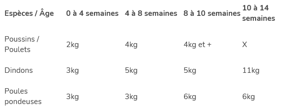
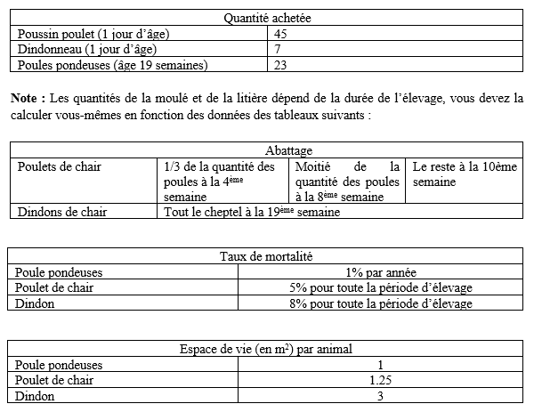
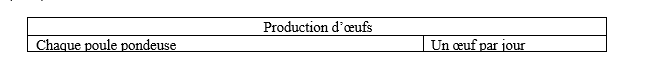
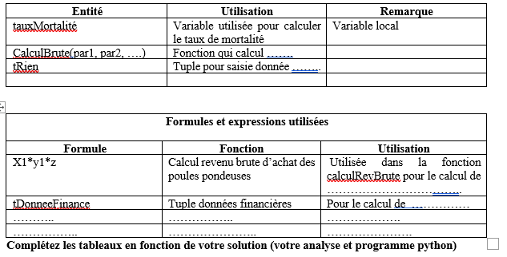

# Donnes: -----------------------------------------------------------------------
### Max quantite par ans:
-	300 poulets de chair
-	99 poules pondeuses
-	25 dindons de chair

---
### Poids des animeaux normal:

---
### Moulee: sac de 25kg

---
### Litiere:
- 9$ par sac
- poulets de chair & dindon: 1/3 sac
- poules pondeuse 1 sac

---
### Slaughter period
- Poule pondeuse update every 2 years.
- Chicken slaughter periode: 5-10 weeks.
- Turkey slaughter periode: 14-20 weeks.

---
### Prices:

---
# Questions: -----------------------------------------------------------------------------
### 1. Sachant que le fermier achete ses animaux le 27 mai de chaque annee civile, calcurler pour une periode d'un an,les frais initiales d'investissement (l'achat initiale comprend les volailles, la moulee et la rip): 30%

### 2. Quelle est la quantite d'oeufs produite pour une periode de deux ans. Prevoir le cas des annees bissextile. 20%

### 3. Le fermier prevoit vendre 80% de sa production d'oeufs au prix de 3.75$ la douzaine. 20%
    3.1 Quel est le revenur brut genere par semaine, mois et annee. 10%
    3.2 Quel est le revenu net genere par semaine, mois et annee. 10%
### 4. Quelle est la derniere journee d'elevage des poulets de chair (5%)
### 5. Quelle est la derniere journee d'elevage des dindons (5%)

---
Note : Le programme principale doit être sous forme de menu textuel : (Les réponses aux questions doivent être sous forme de menu textuel avec sélection par numéro).
Exemple :   
Titre : Programme de gestion automatisé élevage volailles
1. Entrée des données des prix des volailles.
2. Calcul des frais d’investissement initiale.
3. Calcul revenu brut.
4. ...

---
# Critères de correction : -------------------------------------------------------
1. Vous devez utiliser uniquement la matière vue dans le cours. La note zéro sera attribuée à la solution au cas de non-respect de ce critère (6.1) et à ses utilisations et dépendances (exemple : appel de fonction d’un module importé non vu dans le cours).
2. Il est recommandé d’utiliser les fonctions et les procédures.
3. Une réponse correcte qui ne comporte pas de fonction ou de procédure alors qu’il est possible de le faire se voit attribuer une pénalité de 30% de la note de cette dernière.
4. Il est recommandé d’utiliser des fonctions et des procédures paramétrables. Votre fonction pourra être applicable à n’importe quelles données qui respecte les exigences du problème à traiter.
5. La saisie des données doit être validée.
6. Une bonne utilisation des structures de données.
7. Un programme qui ne contient pas ou peu de commentaires pour la compréhension de toutes les parties du code source sera pénalisé par -5%

# Les livrables: ----------------------------------------------------------------------
   1. Un document Word contenant les informations suivantes (02 tableaux).
   - 
   2. Le programme final ayant l’extension py.